= Eden* Microservice

image:src/docs/asciidoc/language-java-blue.svg[]
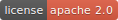
image:https://github.com/eden-lab/eden-microservice/workflows/build/badge.svg["Github Actions",link="https://github.com/eden-lab/eden-microservice/actions"]
image:https://sonarcloud.io/api/project_badges/measure?project=eden-lab_eden-microservice&metric=alert_status["SonarCloud", link="https://sonarcloud.io/dashboard?id=eden-lab_eden-microservice"]

Eden* Microservice 是一组基于 Spring Cloud 体系的微服务应用集，提供了注册中心、配置中心、认证中心和网关中心等模块，
开箱即用，配置灵活，支持二次开发。

== 基本介绍

1. 基于 Eureka 的服务注册框架，提供了丰富的可视化界面，支持集群服务；
2. 可选本地或者 Github 作为配置中心，支持基于 KafKa 或者 RabbitMQ 推送配置变更消息；
3. 网关支持配置服务的访问控制、API 限流过滤器，客户端统一通过网关调用服务；
4. 认证中心使用 OAuth2 作为认证框架，服务间的调用自动集成客户端授权。

== 安装入门

=== 构建源码

Eden* Spring Microservice 的源码支持在 JDK 1.7 以上的版本编译构建

CAUTION: 以下情况需要在 JDK 1.8 以上的版本运行：运行 liquibase-maven-plugin 插件执行性能测试；
使用 swagger2markup-maven-plugin 插件生成接口文档；集成 zipkin 依赖组件。

您可以使用以下命令构建打包为可执行程序：

[source,shell,indent=0]
----

$ ./mvnw clean package

----

构建完成后，在子模块的构建输出目录可以找到后缀名为 jar、zip 或者 tar.gz 的可执行程序。

=== 启动程序

==== 运行环境

1. 认证中心基于关系数据库存储数据，默认使用 MySQL 数据源；
2. 认证中心默认启用非对称加密，可以通过 keytool 工具在命令行生成公钥

[source,shell,indent=1]
----

keytool -genkey -alias uaa -storetype PKCS12 -keyalg RSA -keysize 2048 -keystore keystore.p12 -validity 3650

----

==== 运行顺序

基于模块的依赖关系，请依次按顺序启动程序：

1. eden-registry：注册中心，默认端口为 8761
2. eden-configserver：配置中心，默认端口为 8888
3. eden-uaa：认证中心，默认端口为 9999
4. eden-gateway：网关中心，默认端口为 5555

==== 启动方式

您可以通过以下 4 种方式启动程序：

1. 在 IDE 开发工具直接运行 `org.ylzl.eden.*.Application.java`；
2. 通过命令行 `java -jar` 启动构建输出的 fat-jar 文件；
3. 解压构建输出的 zip 或者 tar.gz 文件，在 bin 目录运行 startup 脚本；
4. 基于 docker-maven-plugin 插件通过 Docker 容器启动。

== 运行界面

=== 登录

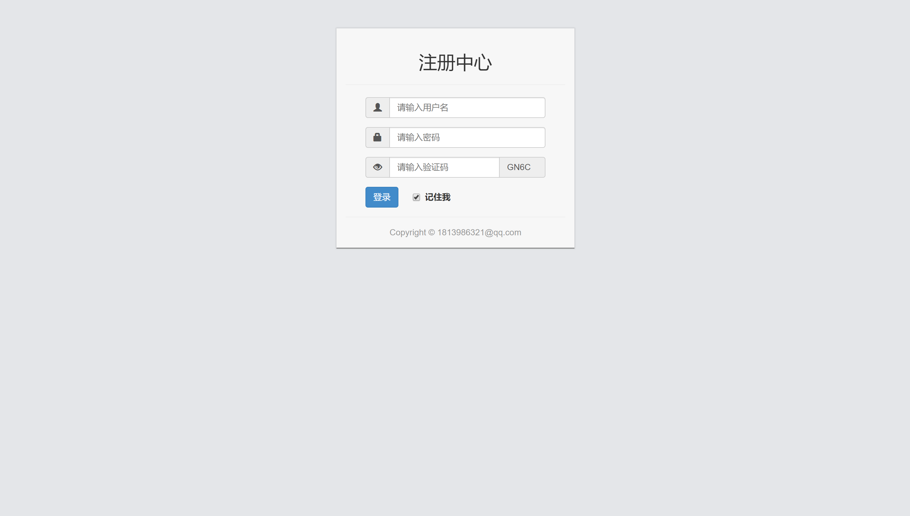

=== 微服务视图

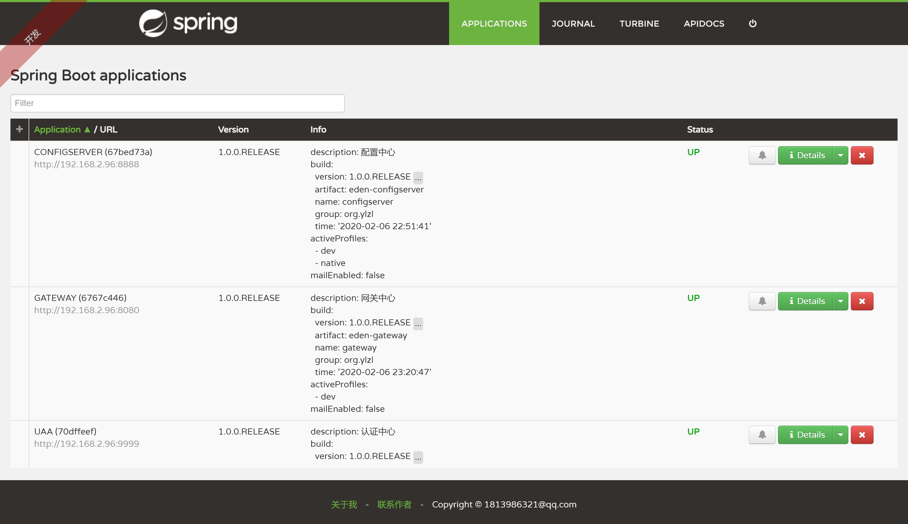

=== 应用详情

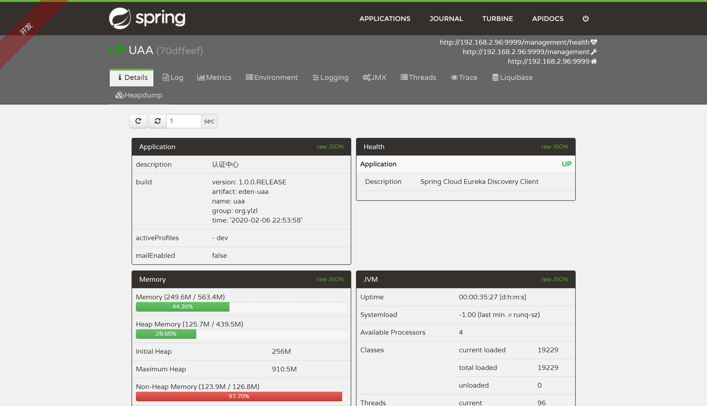

=== 实时日志

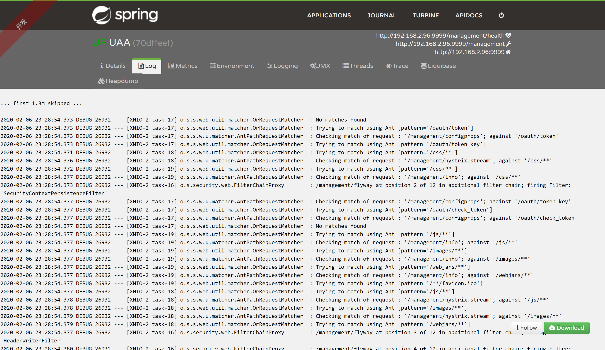

=== Metrics

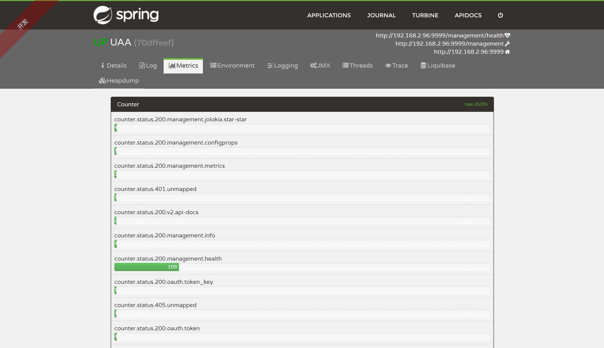

=== 运行环境

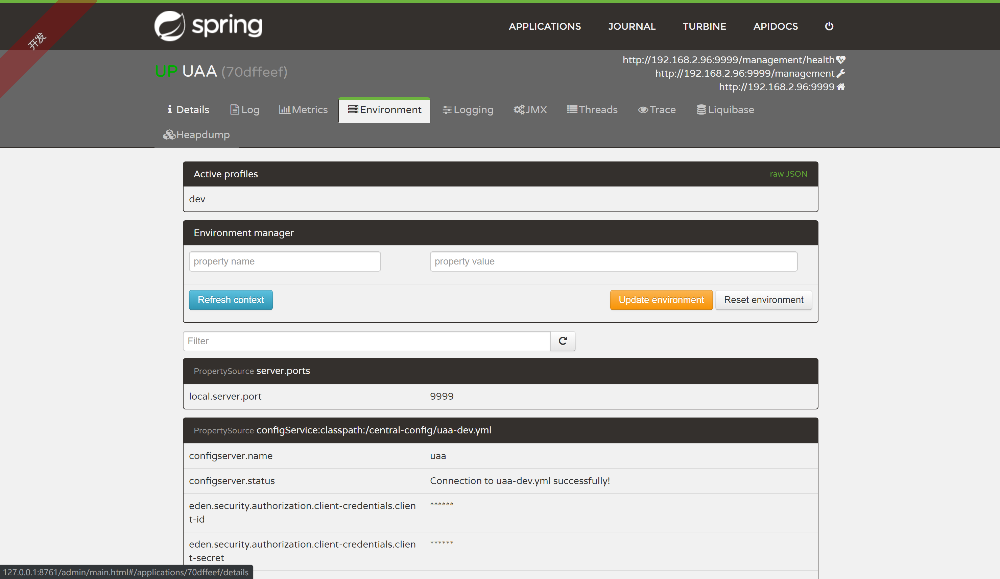

=== 日志控制

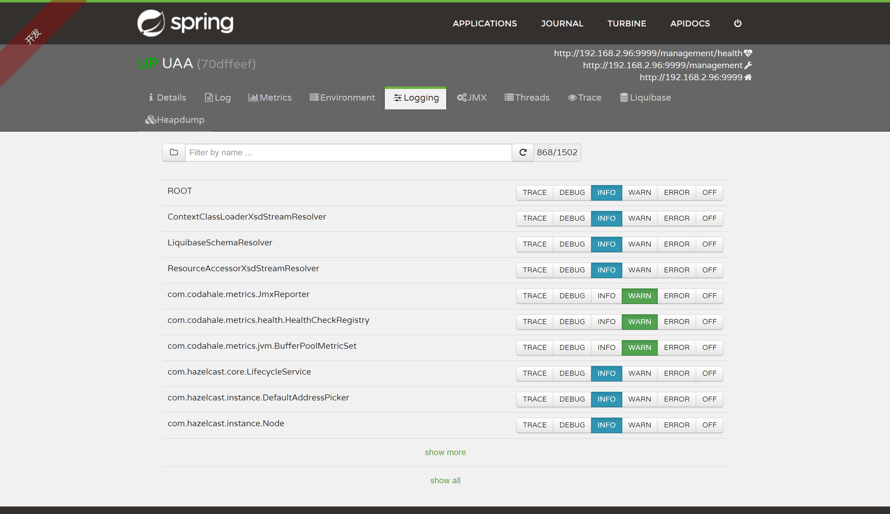

=== JMX 管理

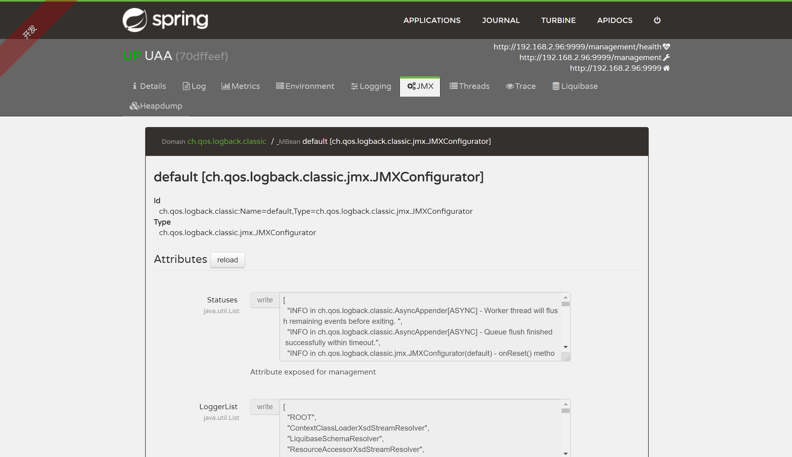

=== 线程监视

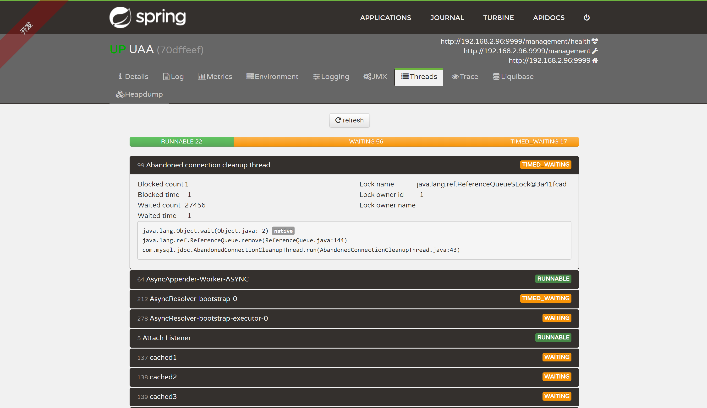

=== 请求跟踪

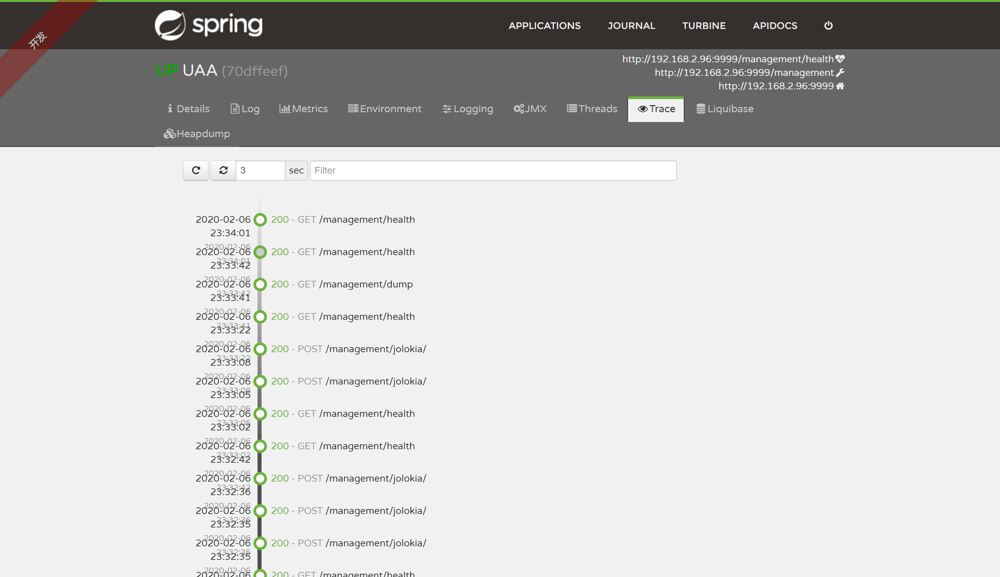

=== Liquibase

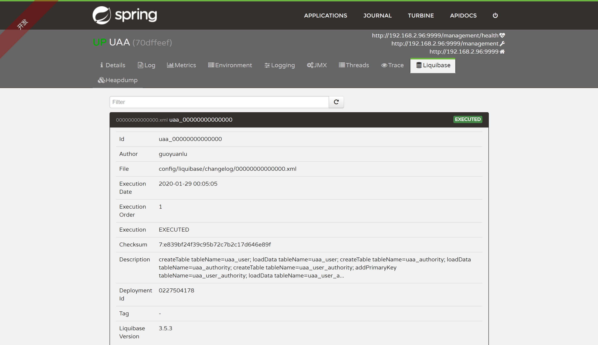

=== 注册事件

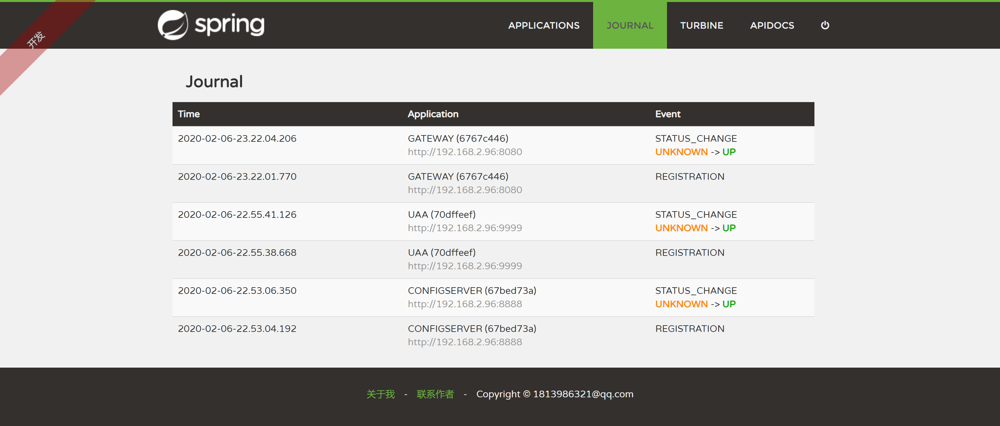

=== 在线接口

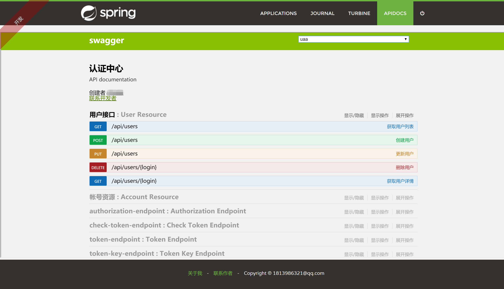

== 体系结构

=== 模块清单

|===
| 应用名称 | 描述 | 技术栈

| eden-configserver
| 配置中心
| Spring Cloud Config

| eden-gateway
| 网关中心
| Netflix Zuul、Feign、Hystrix、Ribbon

| eden-registry
| 注册中心
| Netflix Eureka、Spring Boot Admin

| eden-uaa
| 认证中心
| Spring Security OAuth2、Spring Security Jwt
|===

=== 开发视图

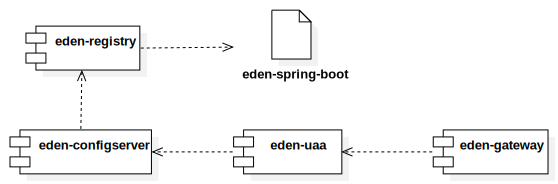

== 许可声明

遵循 https://www.apache.org/licenses/LICENSE-2.0.html[Apache 2.0 License]
